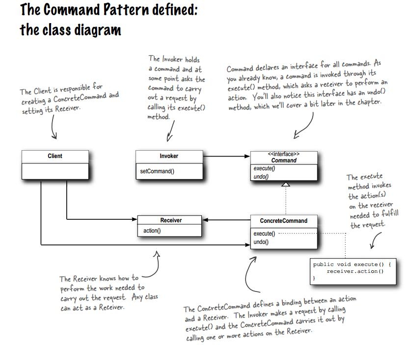

命令模式
=======
命令模式由四部分组成：
*   命令（Command）
*   命令的发出者（Client）
*   命令的接受者（Receiver）
*   命令的执行者（Invoke）



```
public interface Command {
    public void execute();
}


// 具体的命令，拥有一个执行者的引用
public class ConcreteCommand implements Command {

    private Receiver receiver = null;
    private String state;

    public ConcreteCommand(Receiver receiver){
       this.receiver = receiver;
    }
    public void execute() {
       receiver.action();
    }
}

// 命令的执行者，其他模块都是传达，到这里才是真正的执行
public class Receiver {
    public void action(){
       //真正执行命令操作的功能代码
    }
}

// 命令的发出者，拥有一个命令引用
public class Invoker {
    private Command command = null;

    public void setCommand(Command command) {
       this.command = command;
    }

    public void runCommand() {
       command.execute();
    }
}

public class Client {
    public void assemble(){
       //创建接收者
       Receiver receiver = new Receiver();
       //创建命令对象，设定它的接收者
       Command command = new ConcreteCommand(receiver);
       //创建Invoker，把命令对象设置进去
       Invoker invoker = new Invoker();
       invoker.setCommand(command);
    }
}
```

### 命令模式的遐想
1.  命令模式都能干什么呢？

    *   命令模式解耦了“命令的发出者-命令-命令的执行者”，命令的发出者只知道命令是什么，不知道谁来执行；命令只知道谁来执行，不管谁发出的命令。这样的好处就是易于添加新命令和新的命令执行者。
    *   可以创建一个命令队列，用来批处理一样的执行命令
    *   可以做一个“命令记录”，记录每一个命令，当有错误发生的时候，实现**回滚**，这里一次命令记录可以看做一次**事务（Transaction）**

2.  命令模式是如何工作的？

    设计原则中有**变化抽离**，这里的**变化**指的是**各式各样的命令**，将命令抽象出来，然后设定另一个公用的方法`execute()`，这样就使得“变化的命令中有了一个共性”，通过这个共性的方法可以执行不同的代码。