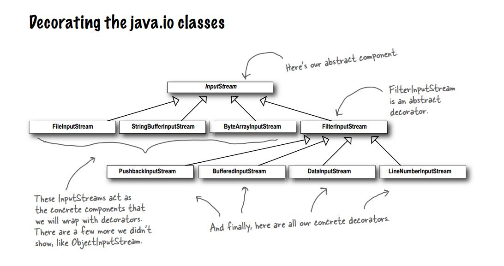

装饰者模式
=========
装饰者模式由：组件和装饰品组成

### 装饰这模式的关键

*   装饰品和组件拥有相同的超类
*   装饰品类内部拥有一个需要装饰的组件

### 继承与组合的不同

*   继承：子类的行为在编译的时候静态决定
*   组合：组合可以实现运行时动态进行扩展
    *   组合形式 1：主体用拥有接口变量，通过对接口的编程并且设定改变了具体的实现，来实现扩展（策略模式）
    *   组合形式 2：主体拥有接口，接口的实现拥有集合，通过在集合中添加对象，来实现扩展（发布订阅模式）

>   Java I/O 中使用的就是装饰模式

