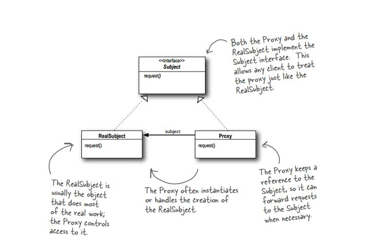

代理模式
========
代理有两个特点：
*   和真实对象一模一样（即实现同一个接口）
*   拥有一个真实的对象（组合）

## 代理的特点
*   透明：代理对使用真是对象的用户而言是不存在的，用户感觉不到有代理的存在，这就是透明。
*   代理做了什么：代理不能仅仅可以充当真实的对象，而且还能够在调用真是的功能前加一些特殊的要求，比如过滤等等

## 代理与装饰者
*   代理可以自己创建一个真实的对象，而装饰者的被装饰对象是通过指定的方式实例化的
*   代理和装饰者都要继承同一个接口，这样一来才能够满足**透明**的要求

>   如果想实现“透明”，首先要长相一致（实现同样的接口），而且还要有一个真正的对象，不然那就露馅了（组合的方式持有一个真实类的实例）
