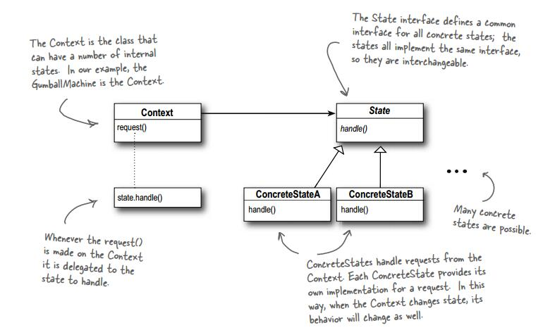

状态模式
=======
*   Context：就是那个Machine（糖果机）
*   State：一个状态的抽象接口
*   ConcreteStateX：一个具体的状态

## 状态模式与策略模式
*   不同：状态模式的各个“策略”都是事先定义好的，而且每个状态的改变是需要具体的动作进行改变。策略模式的各个策略是根据需要及时添加进去的。

*   相同：状态模式和策略模式都通过组合的模式加入新的状态或者策略。